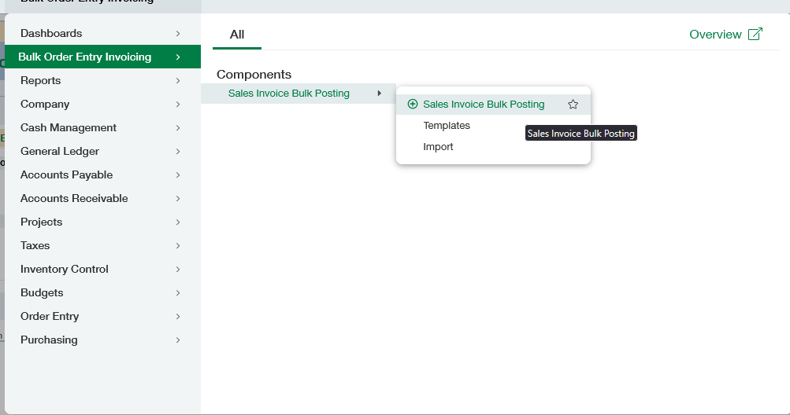
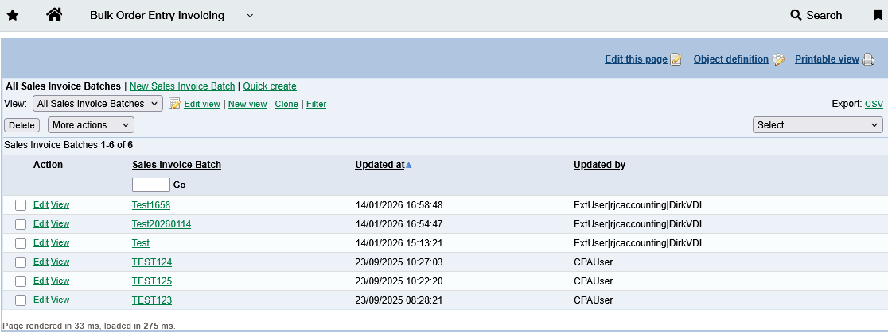
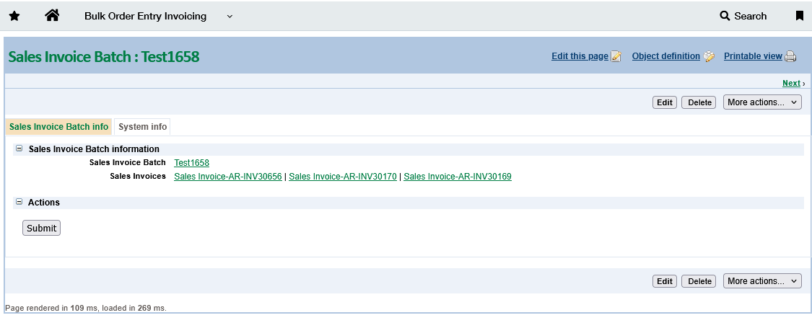
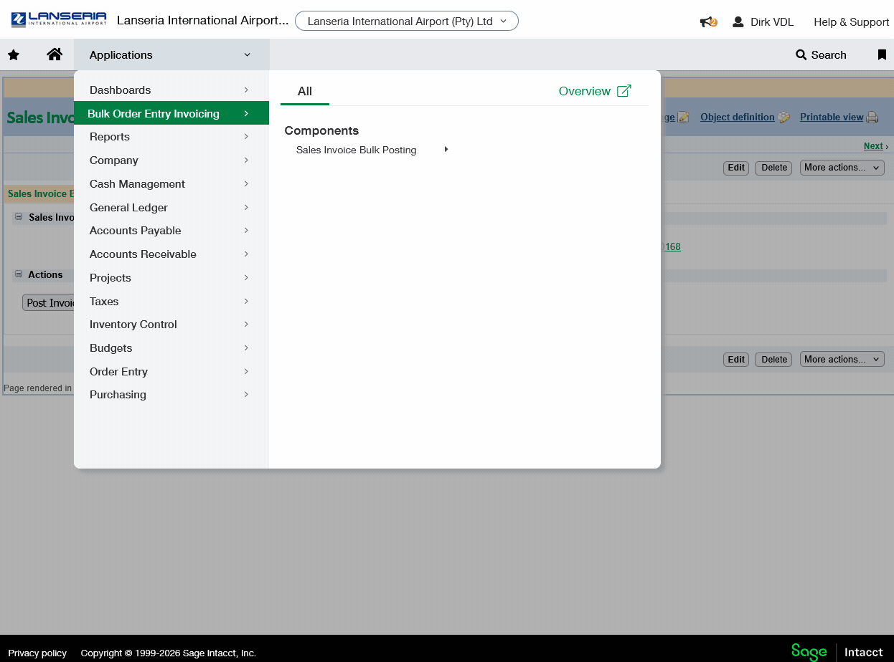

## Intacct Bulk Post Order Entry Sales Invoices 

This is a customisation for Lanseria's Intacct instances to enable users to Bulk Post Order Entry Sales Invoices

### How to install

- Go to **Platform Services** > **Applications** > *Install from XML* and install the `Bulk_Order_Entry_Invoicing.xml` file
- Edit the **Bank Reconciliation** page and create an **HTML Component**. Paste the contents of `modal.html` inside the component.
- Edit the **Bank Reconciliation** page and create a **Script Component**. Paste the contents of `component.html` inside the component.

### Minifying for Production

Make sure you have VSCode extenstion **MinifyAll** from *Jose Gracia Berenguer* installed.

1. Copy all Javascript between the `<script>` tags in `component.html`
2. Open a new tab and paste the contents
3. Use `Ctrl` + `Shift` + `p` and choose *Minify this document ⚡*
4. Paste the output between the `<script>` tags in Intacct

### Screenshots

- **Screenshot of Bulk Order Enty Invoicing**

---

- **Screenshot of Sales Invoice Batches list**

---

- **Screenshot of Success message after AR Advance have been created**

---

- **Screencap of process**

---